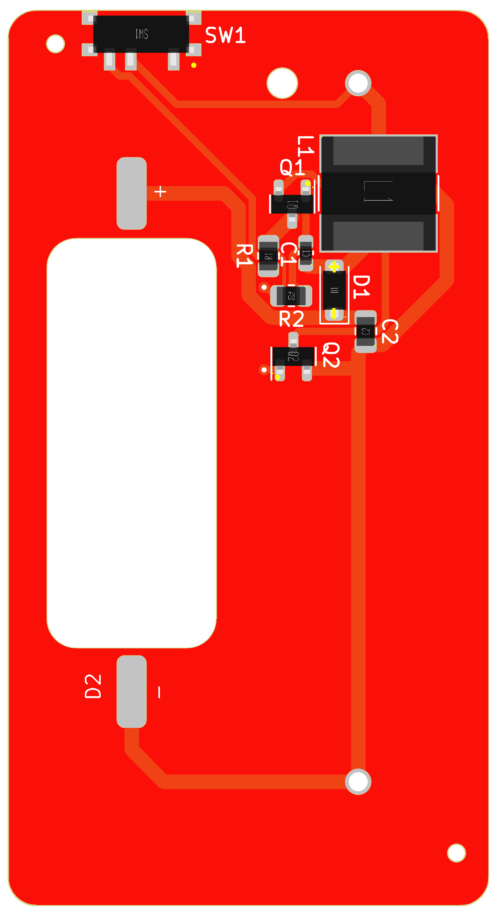
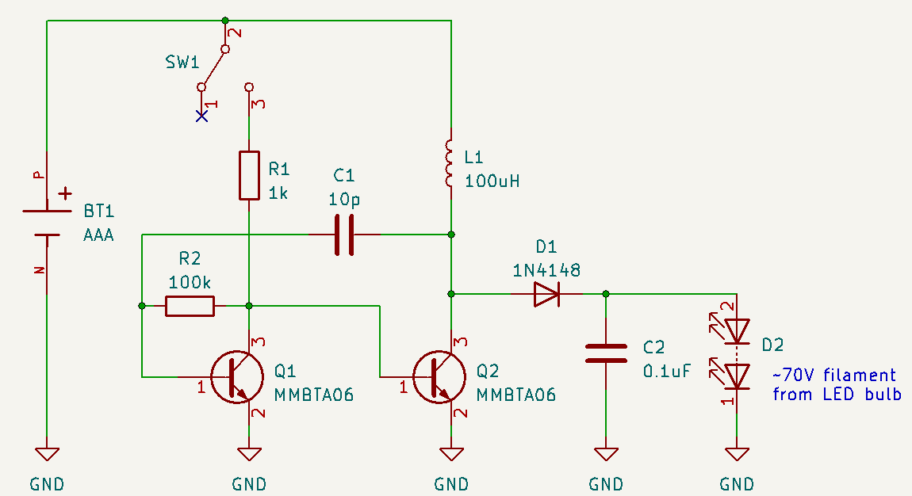

# PetroLED

This is a PCB-design for a LED filament driver that fits into a Feuerhand Atom lantern.
It is powered by a single AAA battery cell. To get the 70V for the filament, it uses a joule thief circuit.
The design is heavily inspired by this article: https://www.instructables.com/Joule-Thief-Filament/
Production data is prepared for JLCPCB including assembly.

